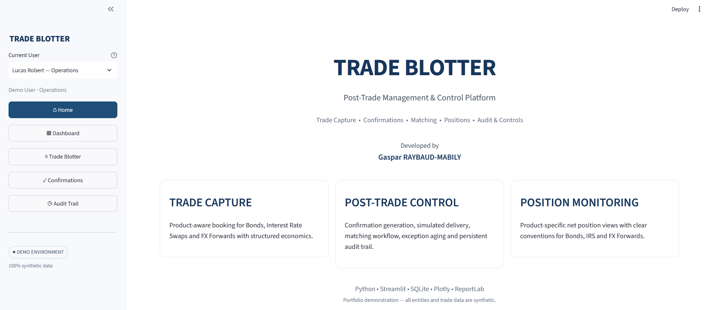
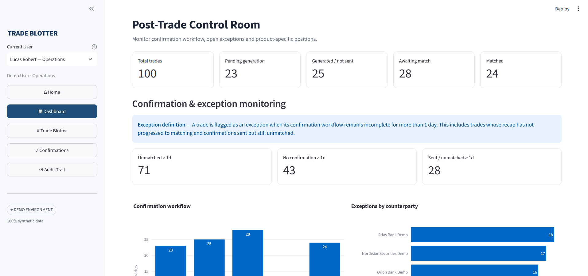
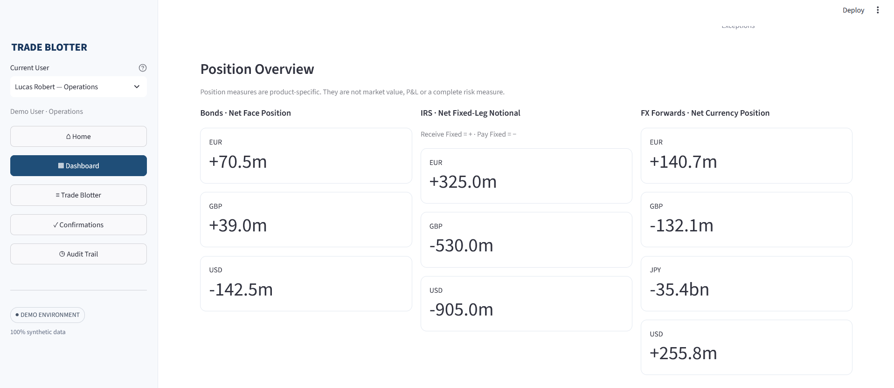
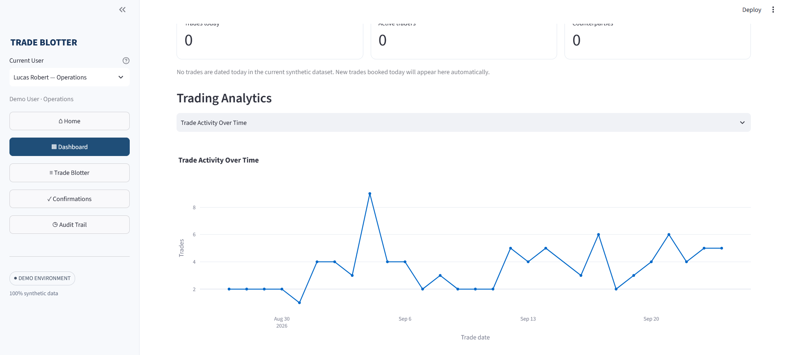
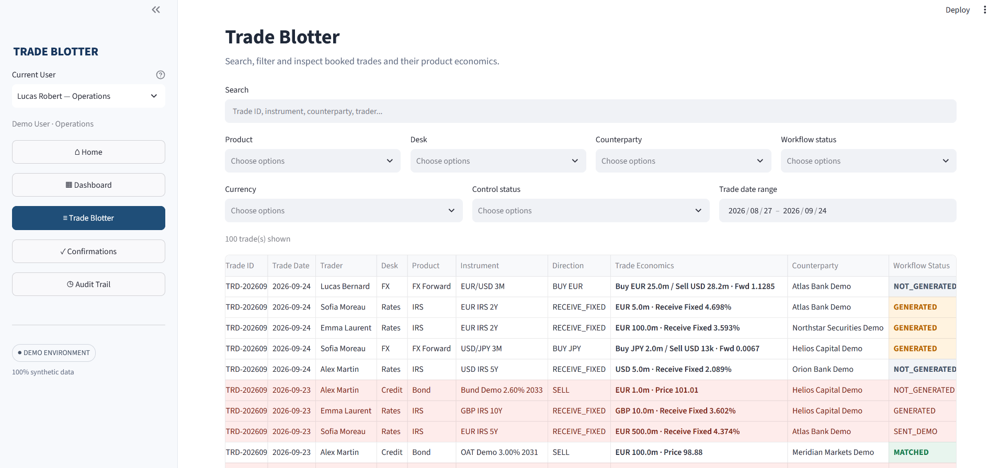
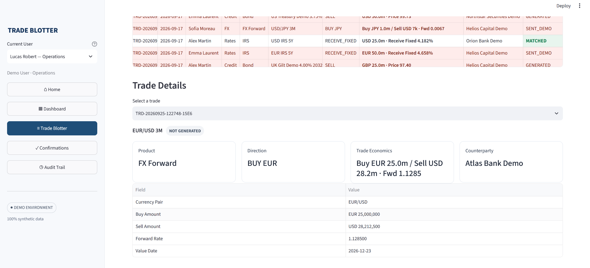
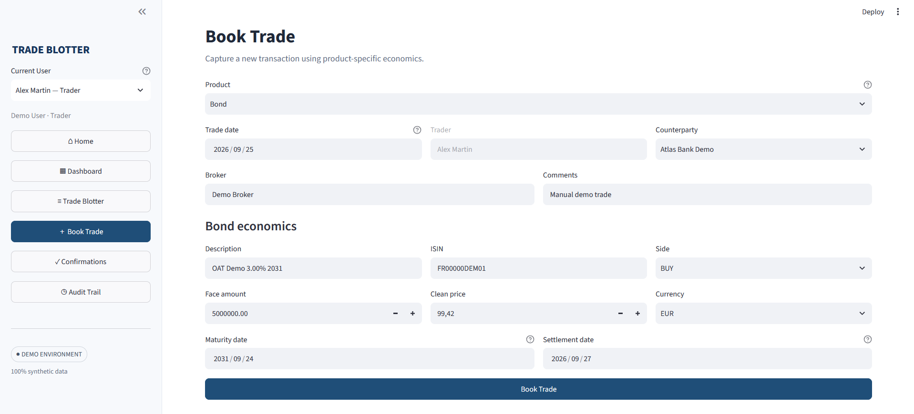
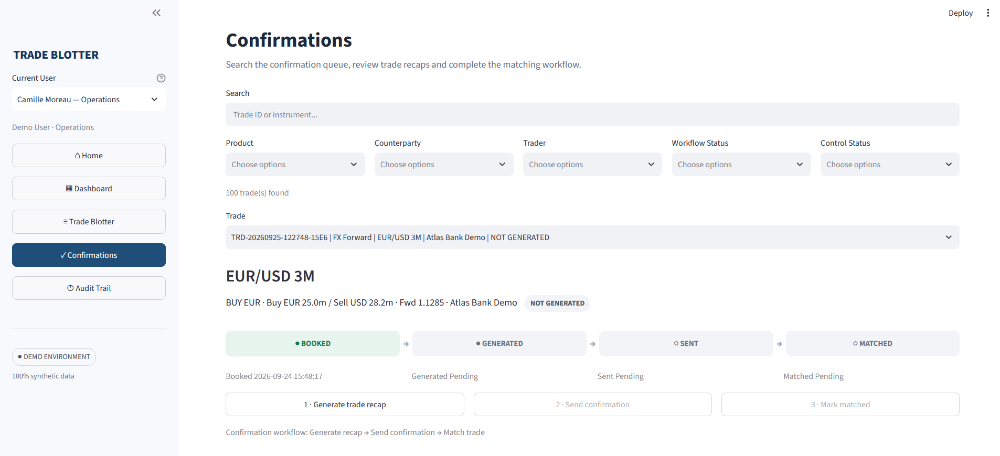
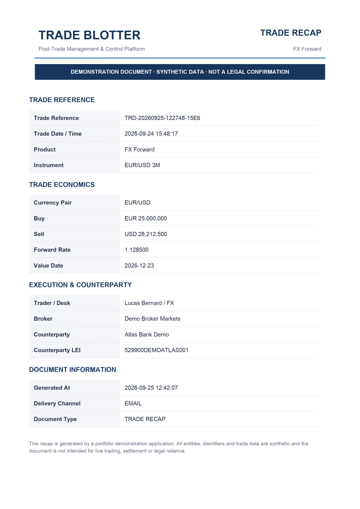
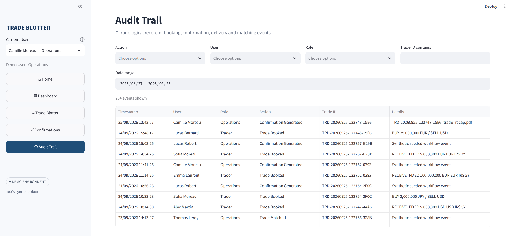

# Trade Blotter

**Post-Trade Management & Control Platform**

A portfolio project simulating a front-to-back post-trade workflow
across **Bonds, Interest Rate Swaps (IRS), and FX Forwards**.

**Developed by Gaspar RAYBAUD-MABILY**

Python · Streamlit · SQLite · Plotly · ReportLab

> **Portfolio demonstration --- 100% synthetic data.**

------------------------------------------------------------------------

## Live Demo

**Coming soon --- Streamlit Community Cloud deployment**

------------------------------------------------------------------------

## Overview

Trade Blotter is an interactive post-trade management application
designed to reproduce key workflows found in a trading environment.

The project combines trade capture, confirmation processing, matching,
position monitoring and audit controls within a single application.

It supports three product families with product-specific economics:

-   **Bonds** --- ISIN, side, face amount, clean price, currency,
    settlement and maturity.
-   **Interest Rate Swaps (IRS)** --- notional, currency, fixed-leg
    direction, fixed rate, floating index, effective date and maturity.
-   **FX Forwards** --- currency pair, buy and sell amounts, forward
    rate and value date.

The application also implements role-based workflows for **Traders,
Operations and Supervisors**.

All trades, users, counterparties and workflow events used in the
application are fictional and generated exclusively for demonstration
purposes.

------------------------------------------------------------------------

## Getting Started

### Requirements

-   Python 3.11+
-   pip
-   Git

### Run Locally

Clone the repository:

``` bash
git clone https://github.com/GasparRaybaudMabily/trade-blotter.git
cd trade-blotter
```

Create a virtual environment:

``` bash
python -m venv .venv
```

Activate it on Windows:

``` powershell
.venv\Scripts\Activate.ps1
```

Install the dependencies:

``` bash
pip install -r requirements.txt
```

Create the synthetic demo database:

``` bash
python seed_demo.py
```

Launch the application:

``` bash
python -m streamlit run app.py
```

------------------------------------------------------------------------

# Using the Application

## User Profiles

The application includes synthetic users representing three different
operational roles.

### Trader

Traders can:

-   book new trades;
-   access the dashboard and trade blotter;
-   monitor their confirmation workflow;
-   access confirmations in read-only mode.

### Operations

Operations users focus on post-trade processing. They can:

-   monitor the confirmation queue;
-   generate trade recaps;
-   simulate confirmation delivery;
-   mark trades as matched;
-   monitor exceptions and audit events.

### Supervisor

Supervisors have broader monitoring and control access across the
platform, including confirmation processing and the audit trail.

The active demo user can be changed directly from the sidebar.

------------------------------------------------------------------------

## 1. Home

The Home page introduces the platform and its main functional areas:

-   Trade Capture
-   Post-Trade Control
-   Position Monitoring

It also provides immediate context about the technologies used and the
synthetic nature of the environment.



------------------------------------------------------------------------

## 2. Post-Trade Control Room

The Dashboard acts as the application's operational control room.

It provides an overview of the complete confirmation population,
including:

-   total booked trades;
-   confirmations pending generation;
-   generated confirmations awaiting delivery;
-   confirmations awaiting matching;
-   matched trades.

A trade is treated as an **exception** when its confirmation workflow
remains incomplete for more than one day.

The dashboard distinguishes between aged trades without a completed
confirmation workflow and confirmations that have already been sent but
remain unmatched.



### Position Overview

Position monitoring is deliberately product-specific rather than
presenting every instrument through a generic exposure metric.

The application calculates:

-   **Bonds --- Net Face Position**
-   **IRS --- Net Fixed-Leg Notional**
-   **FX Forwards --- Net Currency Position**

For IRS positions:

**Receive Fixed = positive**\
**Pay Fixed = negative**

These figures represent nominal positions and should not be interpreted
as market value, P&L or complete risk measures.



### Trading Analytics

The dashboard also provides selectable trading analytics, including:

-   Trade Activity Over Time
-   Trades by Trader
-   Trades by Counterparty
-   Confirmation Aging



------------------------------------------------------------------------

## 3. Trade Blotter

The Trade Blotter provides a consolidated view of all booked
transactions.

Users can search and filter trades by:

-   product;
-   desk;
-   counterparty;
-   workflow status;
-   currency;
-   control status;
-   trade date.

Each row displays compact product-specific economics while keeping the
underlying values unchanged.



### Trade Details

A trade can be selected directly from the blotter to inspect its
economics in more detail.

The displayed information automatically adapts to the selected product.

For example:

**Bond**

`EUR 5.0m · Price 99.42`

**IRS**

`EUR 50.0m · Pay Fixed 2.850%`

**FX Forward**

`Buy EUR 10.0m / Sell USD 11.3m · Fwd 1.1300`

Additional product-specific fields are displayed underneath the main
trade summary.



------------------------------------------------------------------------

## 4. Book Trade

Trade capture is available to users with the **Trader** role.

The booking form dynamically changes according to the selected product.

The application performs validation both at the interface level and
within the business service before a transaction can reach the database.

Examples of controls include:

-   trade dates cannot be in the future;
-   amounts and notionals must be positive;
-   Bond ISINs must follow the demo structural format;
-   settlement and maturity dates must remain chronologically
    consistent;
-   IRS maturity must occur after its effective date;
-   FX Forward value dates must occur after the trade date;
-   FX buy and sell currencies must be consistent with the selected
    currency pair.

Invalid trades are rejected before a Trade ID or booking audit event is
created.



------------------------------------------------------------------------

## 5. Confirmations

The Confirmations page manages the post-trade workflow.

The lifecycle follows four main stages:

``` text
BOOKED → GENERATED → SENT → MATCHED
```

The timeline provides a visual representation of the current state:

-   **Green** --- completed stage
-   **Blue** --- next available action
-   **Grey** --- future stage

Operations and Supervisor users can process confirmations, while Traders
have read-only access.



### Confirmation Process

The operational workflow is intentionally sequential.

**1. Generate Trade Recap**

A product-specific PDF recap is generated from the booked trade
economics.

**2. Send Confirmation**

The application simulates delivery to the counterparty confirmation
address.

No real email is sent in the demo environment.

**3. Mark Matched**

Once the confirmation is considered reconciled with the counterparty,
the trade can be marked as matched.

Each step creates a corresponding audit event.

------------------------------------------------------------------------

## 6. Trade Recap PDF

Generated confirmations are presented as structured **Trade Recaps**.

Each PDF contains:

-   Trade Reference
-   Trade Economics
-   Execution & Counterparty
-   Document Information

The economic section automatically adapts to Bonds, IRS or FX Forwards.

The document also contains an explicit demo disclaimer and is not
intended to represent a legally binding confirmation.



------------------------------------------------------------------------

## 7. Audit Trail

The application maintains a persistent audit trail of key lifecycle
events.

Recorded actions include:

-   trade booking;
-   confirmation generation;
-   simulated confirmation delivery;
-   trade matching.

Each event records contextual information such as:

-   timestamp;
-   user;
-   role;
-   event type;
-   Trade ID;
-   event details.

The Audit Trail can be filtered by action, user, role, Trade ID and date
range.



------------------------------------------------------------------------

# Technical Design

## Architecture

The application separates the user interface, business logic and
persistence layers.

``` text
trade-blotter/
│
├── app.py
├── seed_demo.py
├── requirements.txt
├── README.md
│
├── core/
│   ├── database.py
│   └── models.py
│
├── services/
│   ├── audit_service.py
│   ├── confirmation_service.py
│   ├── counterparty_service.py
│   ├── email_service.py
│   ├── exposure_service.py
│   ├── trade_service.py
│   └── user_service.py
│
├── data/
│   └── generated/
│
├── docs/
│   └── screenshots/
│
└── tests/
```

### Application Flow

``` text
User Interface
     │
     ▼
Streamlit Application
     │
     ▼
Business Services
     │
     ├── Trade validation & booking
     ├── Confirmation processing
     ├── Position calculations
     ├── User / role management
     └── Audit events
     │
     ▼
SQLite Database
```

This separation keeps business rules outside the interface wherever they
represent authoritative controls.

For example, widget restrictions improve the user experience, but the
service layer remains responsible for validating a trade before it can
be persisted.

------------------------------------------------------------------------

# Technology Stack

  Technology          Purpose
  ------------------- --------------------------------------
  **Python**          Core application and business logic
  **Streamlit**       Interactive web interface
  **SQLite**          Relational data persistence
  **Pandas**          Data manipulation and reporting
  **Plotly**          Interactive dashboard visualizations
  **ReportLab**       PDF trade recap generation
  **pytest**          Automated business-rule testing
  **python-dotenv**   Environment configuration

------------------------------------------------------------------------

# Data Model

The application uses a relational structure with common trade
information separated from product-specific economics.

Conceptually:

``` text
trades
  │
  ├── bond_details
  ├── irs_details
  └── fx_forward_details

counterparties
users
audit_events
```

This allows different financial products to share common workflow
information without forcing their economics into a single generic
structure.

------------------------------------------------------------------------

# Synthetic Demo Dataset

The demo database is created through:

``` bash
python seed_demo.py
```

The seeding process creates synthetic:

-   users;
-   counterparties;
-   Bonds;
-   Interest Rate Swaps;
-   FX Forwards;
-   confirmation statuses;
-   audit histories.

Historical workflow events are generated chronologically so that
booking, confirmation generation, delivery and matching remain
internally consistent.

The database itself is not required to be stored in the repository and
can be recreated from the seed script.

------------------------------------------------------------------------

# Automated Tests

The project includes automated tests using **pytest**.

These tests independently verify important business rules rather than
relying only on restrictions in the user interface.

Examples include controls around:

-   positive trade amounts;
-   future trade dates;
-   Bond settlement and maturity chronology;
-   IRS effective and maturity dates;
-   FX Forward value dates;
-   product-specific validation rules.

Run the test suite with:

``` bash
pytest
```

The purpose of these tests is to ensure that invalid transactions are
rejected by the application logic even if the interface layer is
bypassed.

------------------------------------------------------------------------

# Demo & Safety Notes

This repository is a **portfolio demonstration project**.

-   All trade data is synthetic.
-   All counterparties and users are fictional.
-   No production market data is used.
-   No real confirmations are transmitted.
-   No real emails are sent by the demo workflow.
-   Generated Trade Recaps are demonstration documents and are not legal
    confirmations.
-   Position figures are simplified nominal measures and are not
    intended to represent complete market risk.

When deployed on a public demo environment, locally generated data or
files may be reset depending on the hosting environment.

------------------------------------------------------------------------

# Potential Extensions

The current architecture can be extended without changing the core trade
workflow.

Potential additions include:

-   mark-to-market valuation;
-   DV01 / PV01 for interest-rate products;
-   Bond duration and spread sensitivities;
-   FX sensitivities;
-   P&L monitoring;
-   market-data integration;
-   persistent production-grade database storage;
-   authentication and enterprise identity management;
-   real confirmation delivery integrations.

These extensions are intentionally outside the current scope, which
focuses on **trade capture, post-trade workflow, operational controls
and auditability**.
